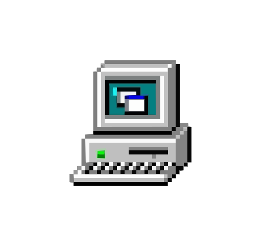

<div align="center">
  
  <h1>Cross-Platform System Monitor</h1>
  <p>A cross-platform desktop application for monitoring system hardware and resource usage in real time.</p>
</div>

<p align="center">
  <a href="#overview">Overview</a> •
  <a href="#current-monitoring">Current Monitoring</a> •
  <a href="#technology-stack">Technology Stack</a> •
  <a href="#architecture">Architecture</a> •
  <a href="#cross-platform-design">Cross-Platform Design</a> •
  <a href="#data">Data</a> •
  <a href="#project-status">Project Status</a>
</p>

---

## Overview

**Cross-Platform System Monitor** is a desktop monitoring application built with a focus on clean architecture, maintainability, and extensibility.

The application collects raw runtime metrics from the host system and presents them through a unified UI while keeping platform-specific monitoring code isolated.

## Current Monitoring

* CPU
* Memory (RAM)
* GPU
* Storage
* Motherboard / system information
* Available sensor data
* Runtime metric discovery

> Hardware and sensor availability depends on the operating system, hardware, drivers, and available monitoring APIs.

## Technology Stack

| Category        | Technology         |
| --------------- | ------------------ |
| Language        | C#                 |
| Platform        | .NET               |
| UI              | Avalonia UI + XAML |
| Pattern         | MVVM               |
| Architecture    | Clean Architecture |
| Database        | SQLite             |
| Version Control | Git + GitHub       |
| Development     | VS Code            |

## Architecture

The project uses **Clean Architecture** to separate monitoring, application logic, and presentation.

```text
Presentation
     ↓
Application
     ↓
Domain
     ↓
Infrastructure
```

* **Presentation** — Avalonia views, XAML, ViewModels, and dashboard components.
* **Application** — Monitoring coordination, services, and application logic.
* **Domain** — Core models, metric definitions, and abstractions.
* **Infrastructure** — OS/hardware APIs, monitoring libraries, persistence, and platform-specific implementations.

### Monitoring Flow

```text
OS & Hardware
      ↓
Platform / Hardware APIs
      ↓
Infrastructure
      ↓
Raw Metrics
      ↓
Application
      ↓
ViewModels
      ↓
Avalonia UI
```

## Cross-Platform Design

Target platforms:

* Windows
* Linux
* macOS

Shared application logic remains platform-independent, while OS-specific monitoring implementations are kept inside **Infrastructure**.

Monitoring capabilities may differ between platforms depending on available APIs, drivers, and hardware.

## Data

Live hardware readings are retrieved directly from the system and do not require a database.

**SQLite** may be used for persistent data such as:

* Historical metrics
* Alert history
* User preferences
* Application configuration

## Project Status

> **Active Development**
>
> The project is currently focused on its core monitoring architecture, runtime metric pipeline, and presentation system.